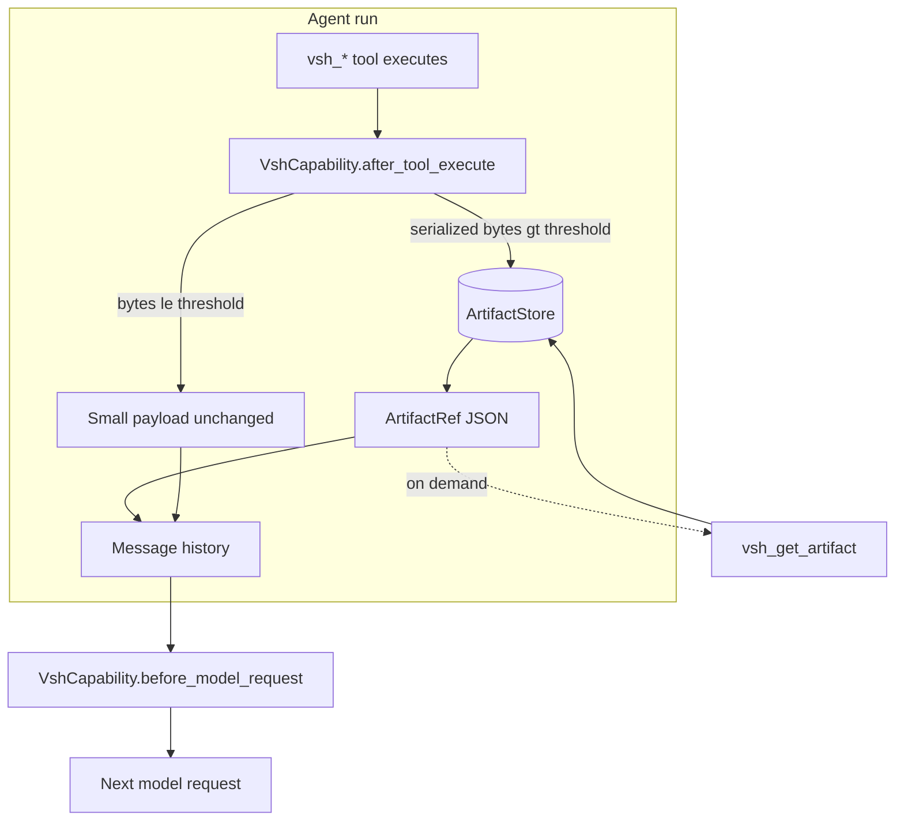

# Artifact spill and execution_reason

Large pydantic-ai tool outputs (`vsh_simulate`, `vsh_sandbox`, …) can flood message
history and blow up context cost. vsh addresses this with an **artifact store**: oversized
agent tool results are persisted and replaced by a compact **`ArtifactRef`**. The model
reads full content on demand via `vsh_get_artifact`.

Separately, **`execution_reason`** records *why* a mutation command is being run. It is
distinct from `SimulationResult.reason`, which carries system policy text.

This guide covers both features end-to-end for pydantic-ai agents.

## Quick run

```bash
cp .env.example .env
# MODEL_NAME + provider API key (e.g. OPENROUTER_API_KEY)

# Live pydantic-ai agent — real model, real tool calls
uv run python examples/artifact_spill_demo.py

# Policy demo only (no LLM)
uv run python examples/artifact_spill_demo.py --policy-only
```

The live demo uses a low `artifact_spill_bytes` threshold (default 1024) so recursive
`vsh_grep` results spill to `ArtifactRef`. The model is prompted to call
`vsh_get_artifact`, `vsh_index_artifact`, `vsh_search_artifacts`, and to demonstrate
`execution_reason` rejection on mutation.

## Problem and design goals

| Problem | vsh approach |
|---------|----------------|
| `vsh_grep` / `vsh_find` return huge JSON blobs | Spill to store; tool result becomes `ArtifactRef` |
| History replays oversized returns on resume | `before_model_request` sanitizes past tool returns |
| Model cannot grep a 200 KB tool payload inline | `vsh_get_artifact` with `offset` / `limit` |
| Important outputs get lost among spills | `vsh_index_artifact` + `vsh_search_artifacts` |
| No audit trail for *why* a write was requested | `execution_reason` on every `StructuredCommand` |

**Scope (current phase):** spill applies to **pydantic-ai `vsh_*` agent tools** only. MCP
tool responses are not spilled yet. `execution_reason` is enforced everywhere simulation
runs (Python, MCP, sandbox, agent).

## Architecture



Hooks live on **`VshCapability`** — there is no separate spill capability or
`build_vsh_capabilities()` factory. `create_vsh_agent` still passes a single
`capabilities=[vsh]` list.

## ArtifactRef

When spill triggers, the tool return is replaced with a flat JSON object:

| Field | Type | Meaning |
|-------|------|---------|
| `artifact_id` | `str` | Lowercase hex (`^[0-9a-f]{8,16}$`) |
| `content_hash` | `str` | SHA-256 of stored bytes |
| `byte_size` | `int` | Payload size in bytes |
| `content_type` | `str` | e.g. `application/json; charset=utf-8` |
| `tool_name` | `str` | Source tool (`vsh_simulate`, …) |
| `preview` | `str` | Short UTF-8 preview (~240 chars) |
| `spilled_at_ns` | `int` | Spill timestamp (nanoseconds) |

Example:

```json
{
  "artifact_id": "a1b2c3d4e5f60708",
  "content_hash": "9f86d081884c7d659a2feaa0c55ad015a3bf4f1b2b0b822cd15d6c15b0f00a08",
  "byte_size": 48291,
  "content_type": "application/json; charset=utf-8",
  "tool_name": "vsh_simulate",
  "preview": "{\"plan_id\":\"plan_abc\",\"decision\":\"approve\",...",
  "spilled_at_ns": 1717845123456789000
}
```

## Spill rules

### Which tools spill?

| Rule | Behavior |
|------|----------|
| Name starts with `vsh_` | Candidate for spill |
| `vsh_get_artifact`, `vsh_index_artifact`, `vsh_search_artifacts` | **Never** spill (loop prevention) |
| Non-`vsh_*` tools | Passthrough |
| Already an `ArtifactRef` shape (`artifact_id` + `content_hash`) | Passthrough |

### Threshold

Serialized payload size is compared to the threshold (default **8192** bytes):

1. `dict` / `list` → JSON (`application/json`)
2. `str` → UTF-8 (`text/plain`)
3. `bytes` → raw (`application/octet-stream`)

Override per run on deps:

```python
from vsh.agent import VshAgentDeps
from vsh.artifacts import MemoryArtifactStore

deps = VshAgentDeps(
    workspace_root="/path/to/workspace",
    artifact_store=MemoryArtifactStore(),
    artifact_spill_bytes=512,  # aggressive spill for testing
)
```

### History safety net

`before_model_request` walks message history and spills any remaining oversized `vsh_*`
tool returns. This covers resume paths and edge cases where a large return slipped into
history before the hook ran.

## ArtifactStore

Protocol: `put`, `get`, `read_bytes`, `index`, `search`.

### Memory backend

Used when `VSH_ARTIFACT_STORE=memory` or `VSH_PERSIST=0`. Ideal for tests and ephemeral
runs.

```python
from vsh.artifacts import MemoryArtifactStore

store = MemoryArtifactStore()
record = store.put(
    tool_name="vsh_simulate",
    payload=b'{"matches": 1200}',
    content_type="application/json",
)
print(record.ref.artifact_id)
print(store.read_bytes(record.ref.artifact_id, offset=0, limit=100))
```

### Filesystem backend

Default when persistence is enabled. Root:

```text
$VSH_DATA_DIR/artifacts/tool_outputs/
  vsh_simulate_a1b2c3d4e5f60708.json
  vsh_simulate_a1b2c3d4e5f60708.manifest.json
```

Manifest holds full `ArtifactRecord` metadata (title, tags, `plan_id`, …).

## Agent tools

Registered on `VshCapability` / `create_vsh_function_toolset()`:

### `vsh_get_artifact`

```python
# Via agent tool call (params)
{
  "artifact_id": "a1b2c3d4e5f60708",
  "offset": 0,
  "limit": 4096
}
```

Returns metadata plus a UTF-8 `content` slice. `truncated` is `true` when more bytes
exist beyond `offset + len(content)`.

### `vsh_index_artifact`

Attach a human title and search tags:

```python
{
  "artifact_id": "a1b2c3d4e5f60708",
  "title": "grep hits before refactor",
  "tags": ["audit", "grep", "src/"]
}
```

### `vsh_search_artifacts`

Query matches:

- exact `artifact_id` (hex)
- substring in `title`
- substring in any `tag`

## execution_reason

### Field

On every `StructuredCommand`:

```python
from vsh.schemas import TouchCommand

cmd = TouchCommand(
    path="notes.txt",
    execution_reason="Create empty notes file for agent scratchpad",
)
```

The field is **not** part of the shell preview (`to_shell()`). It is metadata for policy
and persistence.

### Policy

After normal simulation policy runs, if:

- `approval_tier` is `mutation` or `destructive`, **and**
- `decision` is not already `reject`, **and**
- `execution_reason` is missing or whitespace-only

then simulation is overridden to:

```text
decision = "reject"
reason   = "execution_reason is required for mutation commands"
```

Existing policy rejects (workspace escape, protected paths, shorthand `rm` targets, …) are
**not** overwritten.

### Where to pass it

| Surface | How |
|---------|-----|
| Python | `TouchCommand(..., execution_reason="…")` |
| MCP `simulate` | `params={"path": "x.txt", "execution_reason": "…"}` |
| Sandbox `simulate(...)` | Same params dict |
| Agent `vsh_simulate` | `params` dict **or** `execution_reason="…"` kwarg (merged into params) |

### Persistence

`execution_reason` is stored on `PlanRecord.result.command` and included in the plan
fingerprint. It survives approval and execution.

## Environment variables

| Variable | Default | Meaning |
|----------|---------|---------|
| `VSH_ARTIFACT_SPILL_BYTES` | `8192` | Spill threshold (bytes) |
| `VSH_ARTIFACT_STORE` | `filesystem` | `filesystem` or `memory` |
| `VSH_PERSIST` | `1` | `0` forces in-memory artifact store |
| `VSH_DATA_DIR` | `~/.vsh` | Filesystem store root |

## Agent wiring

```python
from pydantic_ai import Agent
from vsh.agent import VshAgentDeps, VshCapability, create_vsh_agent
from vsh.artifacts import MemoryArtifactStore

vsh = VshCapability("/path/to/workspace")
vsh.deps.artifact_store = MemoryArtifactStore()
vsh.deps.artifact_spill_bytes = 1024

agent, _ = create_vsh_agent(model, "/path/to/workspace", vsh=vsh)
result = agent.run_sync("Inspect workspace safely.", deps=vsh.deps)
```

`VshAgentDeps` fields:

| Field | Purpose |
|-------|---------|
| `artifact_store` | Store backend (default from env factory) |
| `artifact_spill_bytes` | Per-run threshold override |
| `snapshot_id` | Active snapshot for simulate/sandbox |
| `last_plan_id` | Last simulated plan |
| `last_approval_token` | Last approval token |

## Recommended agent workflow

```text
1. vsh_snapshot_workspace
2. vsh_simulate (reads) — large results may return ArtifactRef
3. vsh_get_artifact — pull slices of spilled content as needed
4. vsh_index_artifact — tag outputs worth finding later
5. vsh_simulate (writes) — always pass execution_reason in params
6. vsh_approve → vsh_execute_approved when execution_eligible
```

Instructions baked into `VshCapability` remind the model of spill + `execution_reason`
rules automatically.

## Python-only simulation (no agent)

```python
from vsh.schemas import TouchCommand
from vsh.simulate.engine import simulate_command
from vsh.snapshot.builder import snapshot_workspace

snapshot = snapshot_workspace("/path/to/workspace")
reject = simulate_command(TouchCommand(path="new.txt"), snapshot)
assert reject.reason == "execution_reason is required for mutation commands"

ok = simulate_command(
    TouchCommand(path="new.txt", execution_reason="Bootstrap empty file"),
    snapshot,
)
assert ok.decision == "approve_with_warning"
```

## Limitations and roadmap

| Item | Status |
|------|--------|
| Agent `vsh_*` spill | **Shipped** |
| MCP tool spill | Not yet — MCP returns full JSON |
| Cross-session artifact hydrate | Not yet — store is per-process unless filesystem |
| Sandbox `output` spill | Planned (faz 1.5) |
| Content-hash dedup | Not in v1 |

## Related docs

- [API reference](API.md) — field tables and tool list
- [Architecture](ARCHITECTURE.md) — module map and hook placement
- [pydantic-ai agent demo](../examples/pydantic_ai_agent_demo.py) — baseline agent wiring
- [Artifact spill demo](../examples/artifact_spill_demo.py) — runnable walkthrough for this guide
