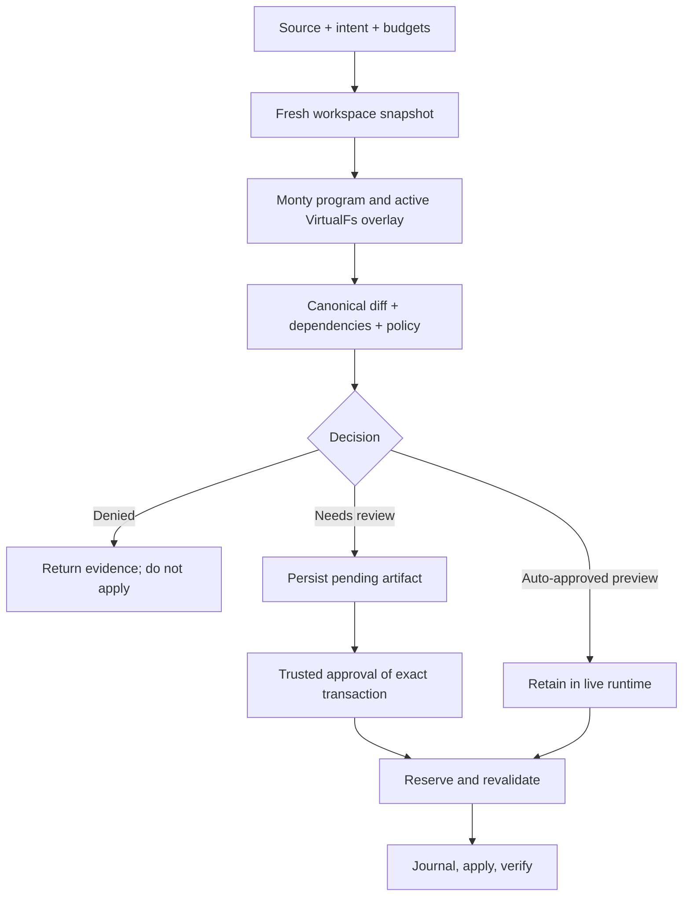

# How VSH works

Think of VSH as a transaction engine for workspace transformations, not a shell with
a dry-run flag. The guest executes real supported operations. Their effects are
recorded in a copy-on-write virtual filesystem and only a trusted committer can apply
the final change set to the host.



## The runtime owns capabilities

`Runtime.open` opens the configured workspace and protected durable storage. The
default data directory is `.vsh-runtime/data`. It rejects unsafe overlap and aliasing,
establishes worker supervision, and runs startup recovery. It does not merely save a
path string for later unrestricted filesystem operations.

Reuse a runtime for repeated work. This reuses capabilities and clean worker processes;
it does **not** reuse a stale snapshot or carry an earlier preview's overlay forward.

## Every request captures a new base

Snapshot capture eagerly traverses metadata for the entire configured workspace.
Contents are lazy: a read materializes bytes only when needed, verifies their identity
against the captured stamp, and stores immutable content. The snapshot is not an
eager full-byte copy and is not a retained operating-system snapshot.

Only the root `.vsh-runtime` directory is excluded by this capture path. `.gitignore`
does not automatically exclude `.venv`, `target`, `node_modules` or other large trees.
Choose the smallest workspace root that contains all required inputs and outputs.

## The guest sees one active overlay

Monty runs a constrained Python subset in a supervised subprocess. Supported `pathlib`
operations suspend into typed calls answered by Rust. In VSH,
the [ten VSH functions](../integrations/monty-tools.md) use the same mechanism and the
same `VirtualFs` instance.

```python
vsh_write('/workspace/result.txt', 'first')
from pathlib import Path
assert Path('/workspace/result.txt').read_text() == 'first'
Path('/workspace/result.txt').write_text('second')
assert vsh_read('/workspace/result.txt') == 'second'
```

There is no inner runtime, nested MCP request or second simulation. Intermediate
generated files are visible within this program. A separate `preview()` starts from
the host again, so dependent staging steps belong in one program.

## Effects and final changes are different evidence

The effect ledger records attempted operations and observed dependencies. The canonical
diff compares final virtual state to the base. Creating and then deleting a temporary
file can yield no final change, while still recording effects. A semantic rename can
escalate policy even when it only rearranged newly generated files.

The transaction identity binds source, intent, snapshot, policy/configuration,
dependencies and canonical diff. Approvals refer to this exact artifact. Changing
source and rerunning creates another execution, not an update to an existing approval.

## Only commit changes user files

Preview always stops before application. Auto mode proceeds only for deterministic
auto-approval. A pending transaction needs an independent trusted-host approval;
hard policy denial cannot be overridden with approval.

Commit reserves the transaction once, serializes the same-workspace mutation window,
revalidates recorded reads/writes and capabilities, applies a journaled plan, and verifies
the result. Input drift produces a stale failure. Interrupted commit may require
recovery; do not equate this with database-wide isolation from arbitrary external
processes or instantaneous multi-file visibility.

## One engine, separate adapters

| Layer | Responsibility |
|---|---|
| Rust runtime and component crates | Snapshot, execution dispatch, diff, policy, state, commit, recovery |
| Python PyO3 binding | One native call per request; typed result and exception conversion |
| CLI / MCP adapter | Request construction and JSON-safe receipt projection |
| Your trusted application | Authentication, workspace selection, budget ceilings, reviewer decisions |

The guest has no exposed shell, network, environment or host-mount capability. This is
not a general-purpose VM or kernel isolation boundary. Read [security](../security.md)
before embedding VSH around untrusted users or agent-produced code.
