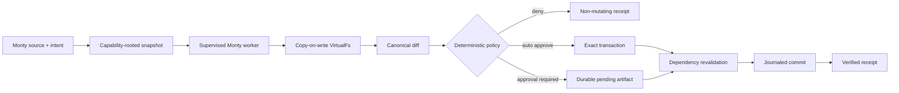

# How VSH works

VSH turns a filesystem program into an inspectable, identity-bound transaction. The
runtime performs the same stages for Rust and Python callers.

## 1. Establish authority

`Runtime.open` resolves a real workspace capability and a separate protected data
directory. It rejects overlap through lexical paths, canonical aliases, prospective
paths, and symlink redirection. Runtime data lives under `.vsh-runtime/data` by default,
is excluded from snapshots, and is denied to Monty.

The runtime also performs startup recovery before it accepts new work. Ambiguous
ownership is reported and left untouched rather than guessed.

## 2. Capture an immutable base

The snapshot records workspace-relative paths, node kinds, metadata identity, and
content versions under explicit limits. It does not grant the worker a host directory.
The snapshot ID becomes part of the transaction binding.

## 3. Execute through typed calls

Monty executes a constrained Python subset in a supervised worker. Filesystem-facing
operations become typed protocol calls into `VirtualFs`. The virtual filesystem reads
from the snapshot and records copy-on-write effects; it does not mutate the host.

The worker has no ambient subprocess, network, environment, or host-mount capability.
Protected absolute paths are rejected before their names or bytes enter the worker.

## 4. Freeze the result

After execution, VSH canonicalizes the effect stream into one diff and records:

- the program and optional out-of-band intent;
- snapshot and runtime-configuration identities;
- read and write dependency digests;
- canonical diff and policy digest;
- bounded result, stdout, statistics, and timings.

These values determine the transaction identity. Approval applies to this artifact,
not to a mutable command string or a future rerun.

## 5. Decide deterministically

Policy first denies protected access and catastrophic bounds. Remaining work is either
auto-approved or marked pending approval according to profile and risk flags. Policy
does not perform a model call, so the same inputs always yield the same decision.

## 6. Revalidate and commit

The committer is the only component allowed to change the workspace. It serializes the
short revalidation/mutation window for a single workspace, then verifies capability
identity, read dependencies, write preconditions, and the host result. Independent
runtimes do not share a process-global lock.

Commit uses durable intent, a checksummed journal, markers, and verification. Recovery
can finish, roll back, clean, or report a conflict without following replaced internal
symlinks.

## Rust owns semantics

| Concern | Owner |
|---|---|
| Snapshot, VirtualFs, canonical diff | Rust crates |
| Monty supervision and typed OS-call protocol | Rust crates + pinned worker |
| Policy, transaction identity, state machine | Rust crates |
| Durable artifact storage, commit, recovery | Rust crates |
| Python object conversion and exception mapping | Thin PyO3 module |
| MCP JSON-safe envelope | Small Python adapter over PyO3 |

There is no Python simulator or Python committer fallback. This is what keeps behavior
and performance aligned across both SDKs.

## Guarantees and boundaries

Read the exact [guarantee contract](../rust-rewrite/GUARANTEES.md) and
[threat model](../rust-rewrite/THREAT_MODEL.md) before treating VSH as a security
boundary. In particular, VSH governs filesystem effects exposed through its typed
surface; it is not a general-purpose operating-system sandbox.
